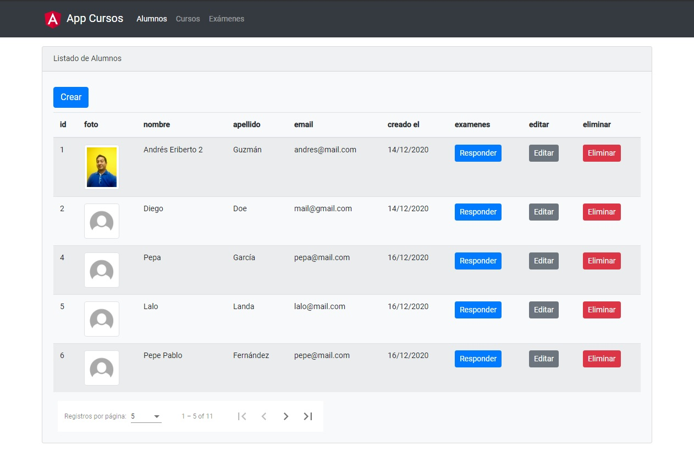
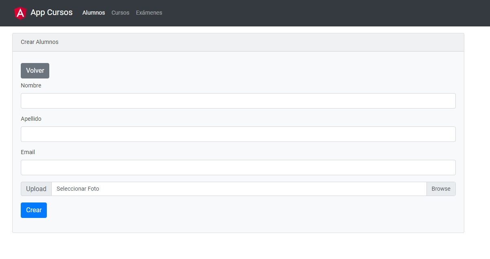
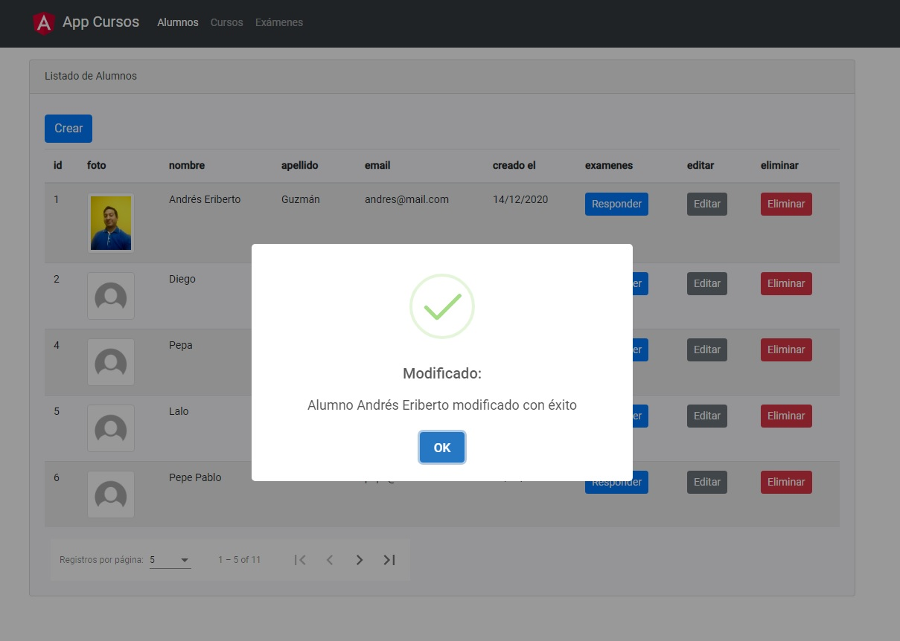
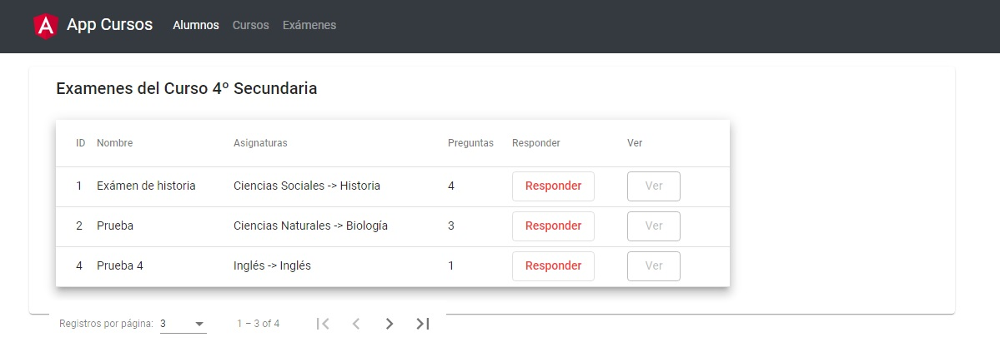
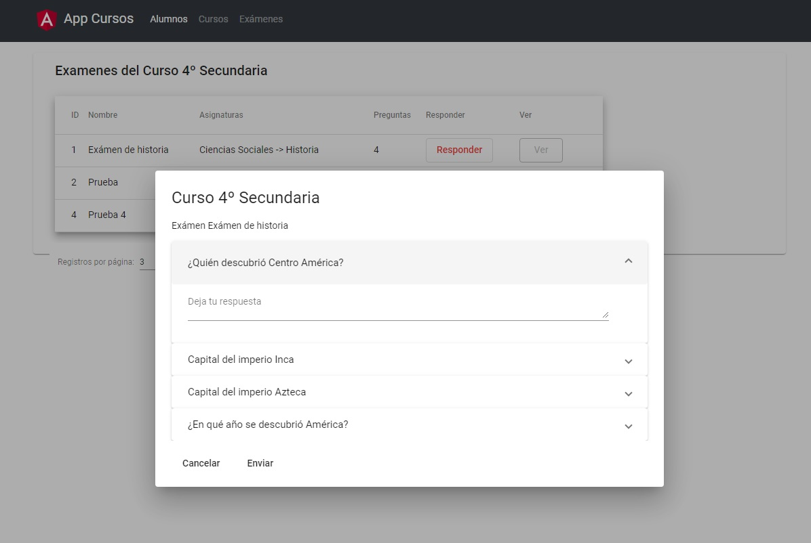
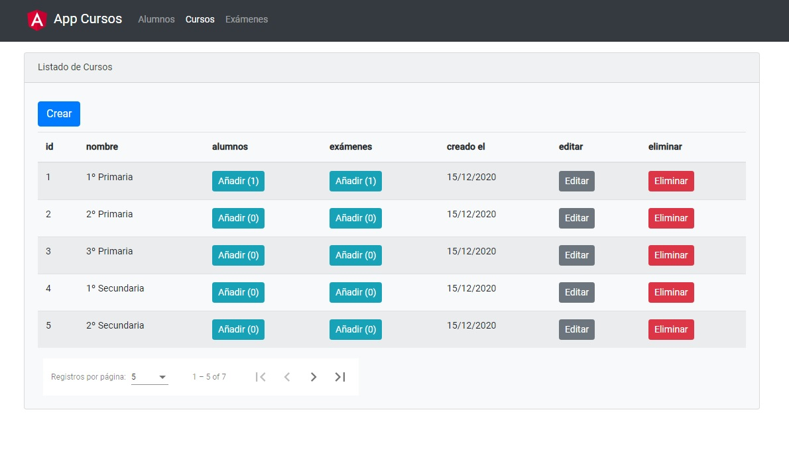
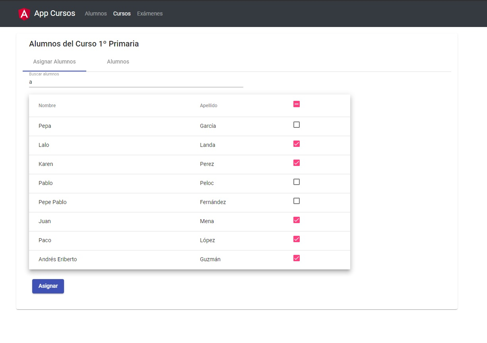
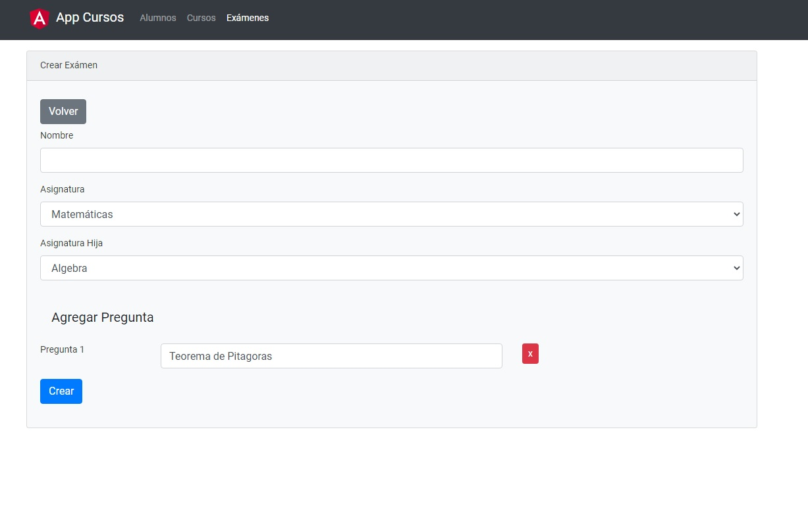
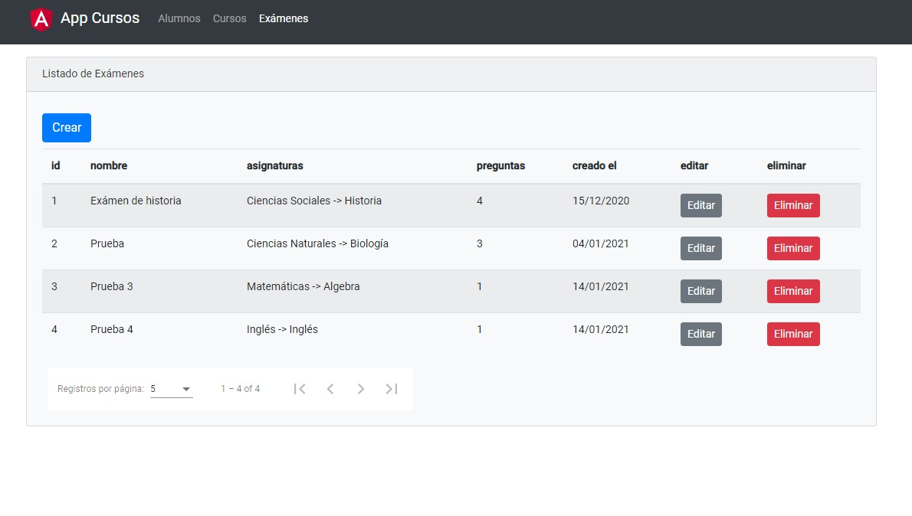

# Microservicios con Spring Cloud y Angular 11

Por el lado del backend se construyó una arquitectura de microservicios con Spring Boot 2 y Spring Cloud, con un completo ecosistema de servicios interconectados mediante el registro y escalamiento con Eureka (servidor de nombre) y como puerta de enlace Spring Cloud Gateway y Zuul, implementando balanceo de carga con Spring Cloud Load Balancer, también trabaja con diferentes patrones de base de datos y persistencia en microservicios con BBDD compartida y con BBDD por microservicios y relaciones con integridad referencial (foreign key) entre las tablas y relaciones distribuidas, usando bases de datos MySQL 8, PostgreSQL y NoSQL con MongoDB.

Luego por el lado del frontend Angular, utilizamos tecnologías de Angular como TypeScript, Angular CLI, ReactiveX (RxJs), Operadores RX, Componentes,  Angular Material, Listas select desplegables y dependientes, Tipos Generics en TypeScript, Observable, Pipe, Directivas, servicios y mucho más, hasta un completo sistema conectado a los endpoints de nuestros microservicios mediante API Rest para implementar CRUD y diferentes operaciones/consultas con relaciones a varias tablas, Hibernate/JPA, paginación, subida de archivos, manejo de errores, validación de formulario y más.

## Herramientas utilizadas:
- Java 8
- Spring Boot
- Spring Cloud
- Eureka
- Spring Cloud Gateway
- Angular
- Angular Material
- MySQL
- Postgres SQL
- MongoDB

## Estructura de Directorios:

- Frontend:
`angular`

- Backend (Eclipse):
`workspace`

- Demos:
`capturas`

## Vista Previa del Proyecto Escuela:

### Vista Previa del Proyecto Escuela:

### Vista Previa Crear Alumno:

### Vista Previa Modificado Exitoso:

### Vista Previa listar Preguntas:

### Vista Previa listar Respuestas:

### Vista Previa listar Cursos:

### Vista Previa del Proyecto Escuela:

### Vista Previa crear Exámen:

### Vista Previa listar Exámenes:

